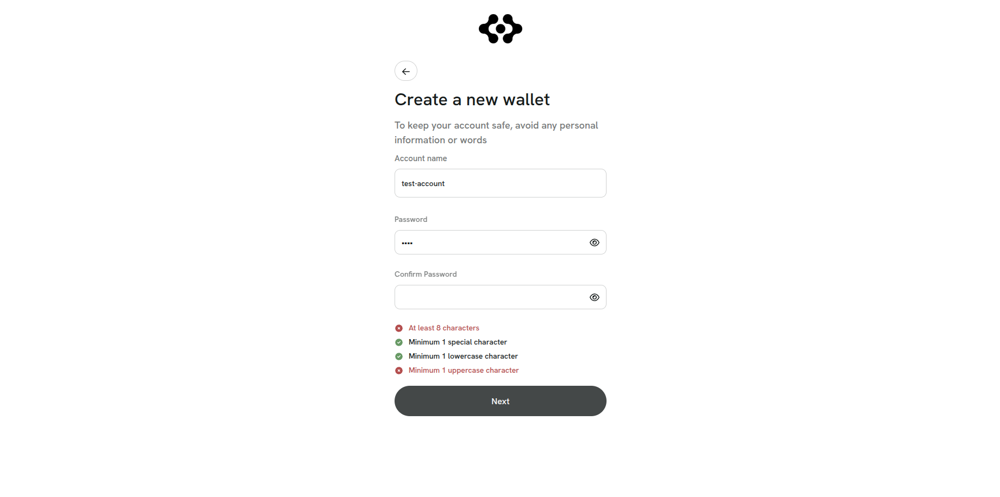
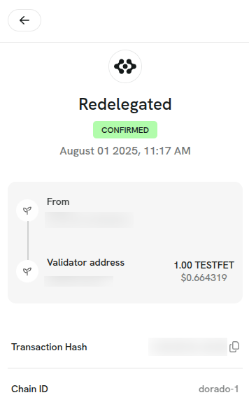
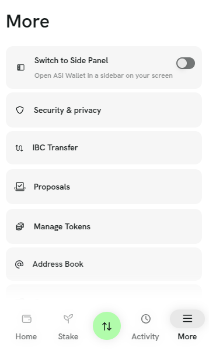

## Release Notes

### Extension UI redesign and theme updates (v0.21.0)
Here’s what’s new and improved in the latest update:

**✨ New Features**
- Added a **Clear All** button for seed phrases in Create / Import wallet screens.

  
- Introduced a **Sign Out confirmation** modal to avoid accidental logouts.

  
- Password validation added to onboarding import/create wallet pages for better security.

  
- Added a **Your Wallets** section in recipient address dropdowns for quick access.

  
- Preventing duplicate wallet names during Create and Import wallet flows.

**🛠 Improvements**

- Updated wallet management flow, it's now easier to switch, edit, or delete wallets.

  
- Chain image URLs updated in configs.

  
- UI and theme improvements across:
  - Home page

    
  - Sign and wallet interaction screens  

    
  - Ledger and staking pages  

    
  - User onboarding (create /import wallet)

      
  - Governance proposal pages  

    
  - Send/Receive Flow  

    
  - Portfolio and IBC transfer  
  - More and Activity sections  
    
    
- Updated app-wide font, theme, icons, and shared components for a more polished look.

**Bug Fixes**

* Fixed decimal input issues in amount fields to prevent invalid entries.
* Resolved layout issues on the onboarding welcome screen and added close icons to modals.
* Fixed minor UI issues in Activity pages and filter dropdown.